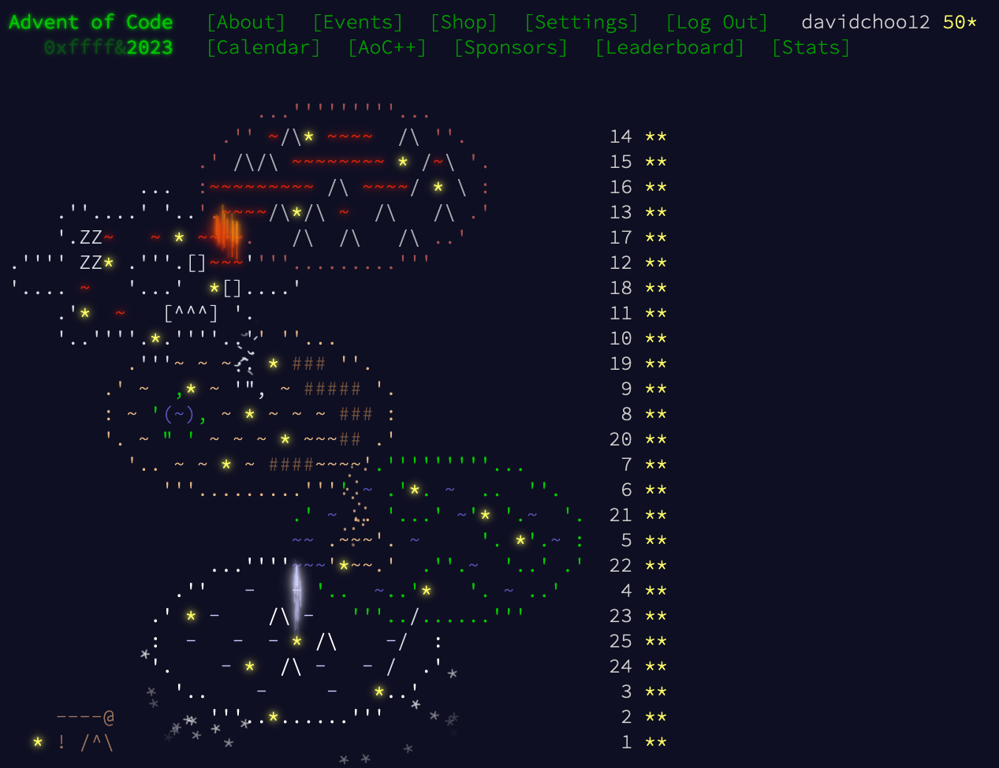
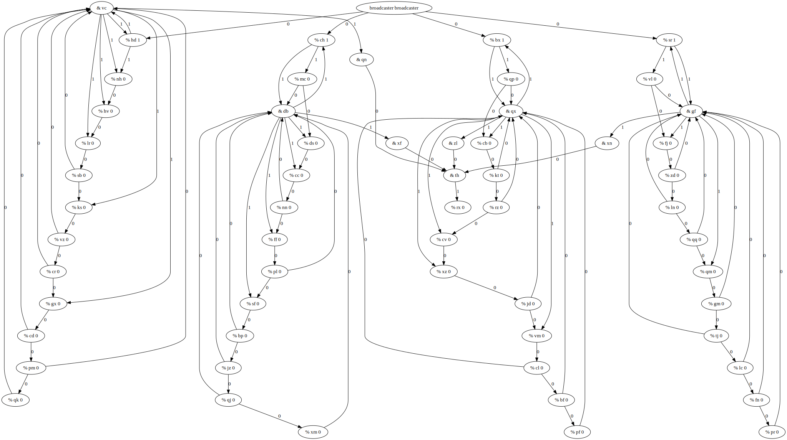
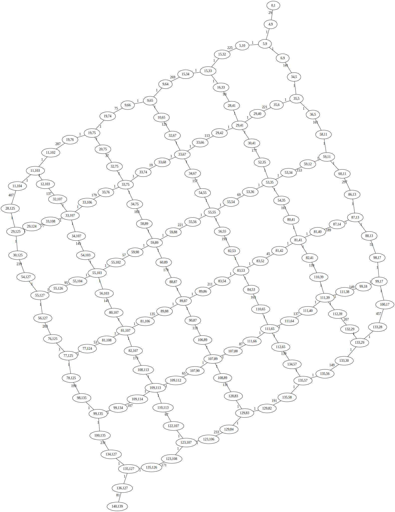
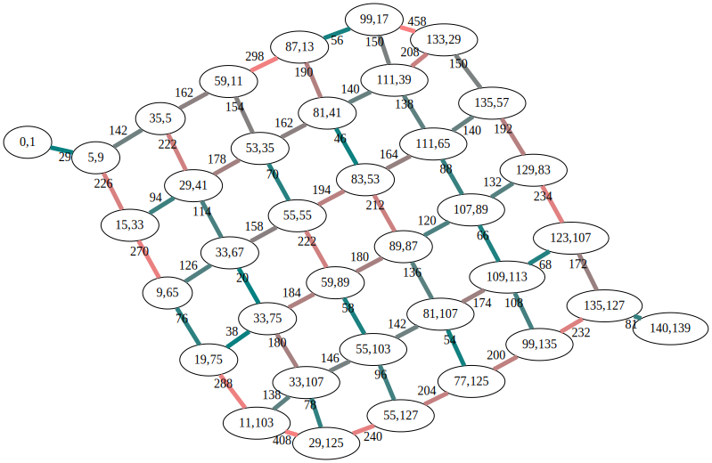

# Advent of Code 2023



This year I decided to give Advent of Code another go. Like in [my previous AoC](https://github.com/davidchoo12/adventofcode2020), I challenged myself to learn another programming language, this time it's Elixir - my first forray into functional programming. The final 8 days have some really hard problems, some of which I would never have figured out if not for [r/adventofcode](https://www.reddit.com/r/adventofcode/) daily solutions threads.

To run the code, do `elixir xx.exs` where xx.exs is the filename.

Here are some of the interesting/hard problems this year.

| Problem | Note                                                                                                                                                                                                                                                                                                                   |
| ------- | ---------------------------------------------------------------------------------------------------------------------------------------------------------------------------------------------------------------------------------------------------------------------------------------------------------------------- |
| 10b     | Geometry problem, solve using Shoelace formula and Pick's theorem [see below](#10b)                                                                                                                                                                                                                                    |
| 14a     | Elegant one liner solution                                                                                                                                                                                                                                                                                             |
| 16a     | Classic BFS/DFS graph traversal, I used BFS                                                                                                                                                                                                                                                                            |
| 16b     | Same as part a except need to run it from many starting points. Got stuck on trying to optimize the solution but ultimately gave up and just brute forced it                                                                                                                                                           |
| 17a     | Dijkstra, code ran overnight to get answer cos unoptimized                                                                                                                                                                                                                                                             |
| 17b     | Reusing part a solution slowed down to a crawl after running it for a day. Decided to investigate and optimize the solution and did a correction, [see below](#17b)                                                                                                                                                    |
| 18a     | Similar to 10b, based on shoelace formula and Pick's theorem, minor tweak to include perimeter                                                                                                                                                                                                                         |
| 20b     | Digital circuit graph. Cannot brute force, tested answer 10000000 and still too low, requires input analysis to investigate the circuit behaviour, used mermaidjs to visualize, found graphviz has better layout, [see below](#20b)                                                                                    |
| 21b     | Geometry problem? (not sure what to categorize for this one) Another input analysis problem, finding patterns in the iterations, [see below](#21b)                                                                                                                                                                     |
| 22a     | Needed to get creative for finding the xy overlap                                                                                                                                                                                                                                                                      |
| 22b     | Jenga as a DAG problem, needed to check the inverse of the directed graph                                                                                                                                                                                                                                              |
| 23b     | Longest path problem on a cyclic undirected grid graph, NP hard problem. Took me days for this one, mostly cos I printed logs on every iteration of the DFS and didn't fully contract the graph to optimize the DFS, [see below](#23b)                                                                                 |
| 24a     | 2 simultaneous linear equations, solved using inverse matrix technique                                                                                                                                                                                                                                                 |
| 24b     | 6 simultaneous linear equations. Another very hard math problem, worked through the equation transforming steps I found from reddit to derive the same 6 linear equations, learnt about Gaussian elimination and LU decomposition linear equation solvers. Implemented Gaussian elimination by hand, [see below](#24b) |
| 25a     | Global min cut on an undirected graph, solved with Stoer-Wagner algo, [see below](#25a)                                                                                                                                                                                                                                |

## Review of Elixir

I chose to use Elixir as I had always wanted to try functional programming and it was recommended as an easier alternative to Haskell by my teammate. Here I listed the things I liked and disliked about Elixir.

### What I liked

- Pipe operator. This behaves just like how the `|` pipe operator does in command line shells and makes nested function calls more readable. Instead of writing `Enum.at(Enum.at(matrix, 1), 2)`, we can do `matrix |> Enum.at(1) |> Enum.at(2)`. I think more languages should have this feature.
- The [Enum cheatsheet](https://hexdocs.pm/elixir/1.16.0-rc.0/enum-cheat.html) is very useful. I kept referencing it since it has all the basic functions for operating on lists, like map, reduce, filter, sum, count, etc.
- `iex` repl for quick testing
- Pattern matching for extracting variables from a nested data structure, like `for [%{x: x1, y: y1}, %{x: x2, y: y2}] <- Enum.chunk_every([Enum.at(path, -1) | path], 2, 1, :discard)` from 10b, to extract x1,y1,x2,y2 to use in the loop.
- Dynamic typing. I took it for granted since I am used to it on python, but I much prefer dynamic typing for code written for myself, not intended as a cooperative work, and even moreso only for one time use.

### What I disliked

- Cannot store state, need to do tricks with passing it as a parameter in a recursion function or as part of the accumulator in a reduce function. I know I can use [Agents](https://hexdocs.pm/elixir/1.16.0-rc.0/agents.html#agents-101) and I did use it once for dynamic programming in 12b, but the code felt quite verbose just for storing/updating a map.
- Printing list of numbers will default to printing it as [charlists](https://hexdocs.pm/elixir/1.16.0-rc.0/binaries-strings-and-charlists.html#charlists), so any integers that can be represented as ascii will be printed as ascii unless you specify `charlists: :as_lists`.
- No `while` loops, can only do recursions or `Enum.reduce_while`
- Variables are immutable, so any change to a variable will have to be assigned to a new variable or reassigned to itself which I didn't realize I can do until quite late.
- No `return`, all `if`, `for`, `case`, etc. return values, so code easily becomes very nested. I understand this is the charm of functional programming but that means I always have to "return" a value.
- [Guard clause](https://hexdocs.pm/elixir/1.16.0-rc.0/patterns-and-guards.html#guards) only allow basic functions in it. I wrote most recursions' base case using the same function with a guard clause as the base case condition but if the condition requires use of an Enum function call, I would have to write it in the same function as the general case but with a giant if-else wrapping it.

## Hard problems

Some problems are hard enough that it took me a long time to solve or I had to look up hints/solutions from reddit. For these problems, I noted down my thought process as I worked through them. The last 8 days of the AoC were brutally difficult. Even moreso since I wanted to solve everything by hand without use of any external libraries or tools, eg networkX for the graph problems or math libraries for the equation solver.

### 10b

From part a, we could get the coordinates of the pipes. So naturally I thought to BFS from a random coordinate until it hits surrounding pipe coordinates, ie the flood fill technique. However, this obviously wouldn't work since we also allow squeezing between pipes. Soon I was out of ideas and had to look up reddit.

Following the logic from [this comment](https://www.reddit.com/r/adventofcode/comments/18f1sgh/comment/kcugm6t/), the idea is to use Pick's formula: `A = i + b/2 - 1` where `A` is polygon area, `i` is count of interior integer points, `b` is count of boundary integer points. The goal is to find `i`: `i = A - b/2 + 1`. We can calculate `A` using shoelace formula and `b` is simply the length of pipe loop. Since all the pipes are laid out in cartesian grid, all points in the pipe loop are considered to be boundary integer points.

#### References

- Pick's formula https://en.wikipedia.org/wiki/Pick's_theorem, explaination video https://www.youtube.com/watch?v=bYW1zOMCQno
- Shoelace formula https://en.wikipedia.org/wiki/Shoelace_formula, explanation video https://www.youtube.com/watch?v=sNPh8jgngE0 and proof website https://sites.google.com/view/matholicism/additional-mathematics/7-coordinate-geometry/7-5-shoelace-method#h.i6feu98fz05h

### 17b

This problem took a very long time to solve. I was faced with 2 issues.

First issue was my very slow part a solution. Reusing the same solution with the parameters tweaked to fit part b couldn't complete running even after a day. At first I naively thought the slowness was due to the recursion. So I changed to use `Enum.reduce_while` but it was still slow. Then I thought it might be due to the `Enum.at` calls when calculating `alt` in the neighbours finding logic. Since Elixir lists are linked lists, `Enum.at` would be an O(n) operation. So I changed the neighbours finding loop to accumulate the dists each iteration so that I can just use the summed value when calculating `alt` instead of accessing the previous neighbour's dist. I also tried to not use the `Enum.slice` at the end of the loop and instead do the checking in the loop to append to the list only if i >= 4. After all that effort, not only it didn't fix the slowness, it also became wrong and unnecessarily complicated so I reverted this logic. Then I thought maybe accessing the cell from the matrix using `Enum.at` twice when finding the neighbours is slow, same reasoning as before. So I changed to use map for storing the matrix but still didn't fix the slowness. Then I suspected might be due to the `Enum.min_by` call which iterates through the whole queue that's growing every loop. So I changed the queue from MapSet to a list, filter to add only neighbours with new shortest distances and crucially, keep the queue sorted after each addition so that I just need to pop the first item instead using `Enum.min_by`. This finally fixed the slowness.

Second issue was correctness. The code ran correct with the example cases but not the actual input. I was stuck on this for a while. Checked subreddit for anyone experiencing same issue but didn't seem like it. Randomly decided to test with this case which is just the second example but flipped vertical and horizontally. Found that it gave a different answer 111 than the original second example 71.

```
199999999999
199999999999
199999999999
199999999999
111111111111
```

Aha! Issue was by tracking the shortest distances using only {x, y}, it saves the bottom row up to the second last column with the shortest dist starting from `{0, 0, :down}`, but it ran out of `:right` quota just before the last column, so when cells from the top tries to reach cells below, the accumulated dist is bigger and will be rejected:

```
1>9999999999
1v9999999999
1v9999999999
1v9999999999
1X1111111111
```

which resulted in finding the path heading up then right to the last column before heading down:

```
1999999^>>>>
v999999^999v
v999999^999v
v999999^999v
v>>>>>>>111v
```

Solution was to make `dists` track the direction as well, instead of just `{x, y}`, should be `{x, y, direction}`.

### 20b

This problem requires input analysis. The only general solution would be to brute force it, which I did try but it never terminated. I tried answering 10,000,000 and got the hint that it's still too low. So clearly I could not just brute force it. I printed the graph as a mermaidjs flowchart and plotted it using the [online editor](https://mermaid.live/) but the graph layout wasn't great cos the edges were overlapping. I checked reddit and got the hint that it's a binary counter and more importantly, I found out about graphviz which produced a much better graph layout. I used the [online editor](https://dreampuf.github.io/GraphvizOnline/) and plotted the graph with each iteration.

1 button press:


2 button presses:


2048 button presses:


I observed the chained flipflops' states followed the binary counter pattern where they represent the number of iterations (ie the button presses). So simply setting the iteration count to match the edges (ie the wires) feeding into the conjunction nodes (ie the nand gates) would flip its output bit. Do the same for all 4 chains of flipflops and find the LCM to get the answer.

I actually implemented a binary counter circuit back in uni as an assignment from the [CS2100](https://nusmods.com/modules/CS2100) module. I tried to figure out what's the type of flip flop based on its behaviour, seems like it's an inverted D flip flop, ie triggered on 0 instead of 1.

#### References

- Hint about input analysis to figure out binary counter https://www.reddit.com/r/adventofcode/comments/18mmfxb/comment/kegwrl1/
- Very nice visualization https://www.reddit.com/r/adventofcode/comments/18mypla/2023_day_20_input_data_plot/

### 21b

This is one of the problems I wouldn't be able to solve myself, had to seek reddit for hints and found this elegant solution. The following is a long explanation for the solution, written as I processed my understanding of it.

Actual input width = height = 131
Actual max steps = 26501365 = 65 + 131 \* 202300

Base case with 3x3 grid, ignoring rock tiles

```
...
...
...
```

If max steps = 1 = floor(w/2), reachable tiles = 5:

```
.O.
OOO
.O.
```

If max steps = 4 = w + floor(w/2), reachable tiles = 41:

```
....O....
...OOO...
..OOOOO..
.OOOOOOO.
OOOOOOOOO
.OOOOOOO.
..OOOOO..
...OOO...
....O....
```

Coloring based on blocks of base grid:

```
....B....
...BBB...
..ABBBC..
.DDEEEFF.
DDDEEEFFF
.DDEEEFF.
..GHHHI..
...HHH...
....H....
```

Blocks B, D, F, H spread from middle of edges, ie crawl from each of 4 edge middles at max step of width  
Blocks A, C, G, I spread from corners, ie crawl from each of 4 corners at max step of floor(width/2) = 1 in this case  
Block E is the full grid

If max steps = 7 = 2w + floor(w/2), reachable tiles = 113:

```
.......C.......
......CCC......
.....BCCCD.....
....FFGGGHH....
...FFFGGGHHH...
..EFFFGGGHHHI..
.JJKKKLLLMMMNN.
JJJKKKLLLMMMNNN
.JJKKKLLLMMMNN.
..OPPPQQQRRRS..
...PPPQQQRRR...
....PPQQQRR....
.....UVVVW.....
......VVV......
.......V.......
```

Blocks C, J, N, V are the same edge middle blocks  
We also have small corner blocks same as before and this time in pairs: B = E, D = I, O = U, S = W  
Now we have big corner blocks F, H, P, R, ie crawl from each of the 4 corners at max step of width-1+floor(width/2) = 4 in this case  
Blocks G, K, L, M, Q are full grids, but if we color them based on the parity:

```
.......C.......
......C.C......
.....B.C.D.....
....F.G.G.H....
...F.F.G.H.H...
..E.F.G.G.H.I..
.J.K.K.L.M.M.N.
J.J.K.L.L.M.N.N
.J.K.K.L.M.M.N.
..O.P.Q.Q.R.S..
...P.P.Q.R.R...
....P.Q.Q.R....
.....U.V.W.....
......V.V......
.......V.......
```

Blocks G, K, M, Q are in even parity with 5 reachable tiles each and block L is in odd parity with 4 reachable tile  
So we have in total:

- 4 edge middles: C, J, N, V
- 8 small corners: B, D, E, I, O, S, U, W
- 4 big corners: F, H, P, R
- 4 evens: G, K, M, Q
- 1 odd: L

which makes this pattern in blocks: (edge middles = M, small corners = c, big corners = C, evens = E, odds = O)

```
.cMc.
cCMCc
MEOEM
cCECc
.cMc.
```

Expanding with bigger examples:  
If max steps = 10 = 3w + floor(w/2), reachable tiles before parity = 221:

```
..........A..........
.........A.A.........
........B.A.C........
.......E.F.F.G.......
......E.E.F.G.G......
.....D.E.F.F.G.H.....
....J.K.K.L.M.M.N....
...J.J.K.L.L.M.N.N...
..I.J.K.K.L.M.M.N.O..
.P.Q.Q.R.S.S.T.U.U.V.
P.P.Q.R.R.S.T.T.U.V.V
.P.Q.Q.R.S.S.T.U.U.V.
..W.X.Y.Y.Z.a.a.b.c..
...X.X.Y.Z.Z.a.b.b...
....X.Y.Y.Z.a.a.b....
.....d.e.f.f.g.h.....
......e.e.f.g.g......
.......e.f.f.g.......
........i.j.k........
.........j.j.........
..........j..........
```

```
..cMc..
.cCECc.
cCEOECc
MEOEOEM
cCEOECc
.cCECc.
..cMc..
```

Total:

- 4 edge middles: A, P, V, j
- 12 small corners: B, C, D, H, I, O, W, c, d, h, i, k
- 8 big corners: E, G, J, N, X, b, e, g
- 9 evens: F, K, M, Q, S, U, Y, a, f
- 4 odds: L, R, T, Z

If max steps = 13 = 4w + floor(w/2):

```
.............A.............
............A.A............
...........B.A.C...........
..........E.F.F.G..........
.........E.E.F.G.G.........
........D.E.F.F.G.H........
.......J.K.K.L.M.M.N.......
......J.J.K.L.L.M.N.N......
.....I.J.K.K.L.M.M.N.O.....
....Q.R.R.S.T.T.U.V.V.W....
...Q.Q.R.S.S.T.U.U.V.W.W...
..P.Q.R.R.S.T.T.U.V.V.W.Y..
.Z.a.a.b.c.c.d.e.e.f.g.g.h.
Z.Z.a.b.b.c.d.d.e.f.f.g.h.h
.Z.a.a.b.c.c.d.e.e.f.g.g.h.
..i.j.k.k.l.m.m.n.o.o.p.q..
...j.j.k.l.l.m.n.n.o.p.p...
....j.k.k.l.m.m.n.o.o.p....
.....r.s.t.t.u.v.v.w.x.....
......s.s.t.u.u.v.w.w......
.......s.t.t.u.v.v.w.......
........y.z.!.!.@.#........
.........z.z.!.@.@.........
..........z.!.!.@..........
...........$.%.^...........
............%.%............
.............%.............
```

```
...cMc...
..cCMCc..
.cCEOECc.
cCEOEOECc
MEOEOEOEM
cCEOEOECc
.cCEOECc.
..cCMCc..
...cMc...
```

Total:

- 4 edge middles: A, Z, h, %
- 16 small corners: B, C, D, H, I, O, P, Y, i, q, r, x, y, #, $, ^
- 12 big corners: E, G, J, N, Q, W, j, p, s, w, z, @
- 16 evens: F, K, M, R, T, V, a, c, e, g, k, m, o, t, v, !
- 9 odds: L, S, U, b, d, f, l, n, u

So to generalize, for max steps = N \* w + floor(w/2), we have total of:  
4 edge middles + 4N small corners + (4N-4) big corners + N^2 evens + (N-1)^2 odds

We can group the edge middles, small corners and big corners into their respective sets of 4, so the formula simplifies to:  
1 edge middle sets + N small corners sets + (N-1) big corners sets + N^2 evens + (N-1)^2 odds

Finally, we just have to find the count of each of the pieces and calculate the sum with N = 202300 to get the answer.

#### References

- Source of the solution https://www.reddit.com/r/adventofcode/comments/18o4y0m/2023_day_21_part_B_algebraic_solution_using_only/
- Another good visualization https://raw.githubusercontent.com/Manitary/advent-of-code/c44838423066b3c8d446f0d94f2a19d675f2b6dc/2023/python/day21.png

### 23b

I spent the most time on this question, mostly cos I left it running for days while solving other questions. This is a longest path problem on a cyclic undirected graph, which according to wikipedia is a NP-hard problem. Simply reusing the same solution for part a and tweaking the condition for finding the next tile made it obvious that I needed a different approach cos it wouldn't terminate way after the 12s it took for part a. Initially I tried optimizing it by memoizing the straight paths, ie consecutive chain of nodes that has only 1 next node, so that the DFS can skip to the end of the straight path when encountered. I ran this for 2 days and it still didn't terminate. I could see based on the logs that it had found almost 170k possible paths and was still growing.

I had the idea of choosing edges by its weight until a path is formed from entry to exit but quickly realized it won't work even for this basic case.

```
A --2-- B --2-- D
|               |
1               |
|               |
C ------4-------+
```

Let's say we want to go from A to D, then it would have chosen edges CD, AB, BD and terminates cos it found path A-B-D but that's not the longest.

I saw reddit's direction was to do edge contraction, ie to simplify the graph such that there are only intersection nodes and distances between the intersections as the edges. I was essentially working in the same direction with the memoization, except I'm skipping to the node prior to the next intersection instead of the intersection itself. So effectively I was working with 154 nodes + 140 edges.



I ran this for 2 days in the background while I worked on the other problems. However, it never completed and eventually, I was left with only this last problem. I decided to actually build a second graph with fully contracted edges. So I run the DFS once to traverse the whole map to find the intersections and distances between them. Now we have 36 nodes + 60 edges including the entry and exit nodes.


Edges colored by weight (red = longer distance = better)

I just had to use this as the new graph for finding the longest path. However, I unknowingly ran the longest path finding on the semi contracted graph and it completed after 17m29s! I realize the most significant difference with my previous attempt was the logs printing. Previously I printed the stack size and count of paths found at every iteration of the DFS.

One final optimization I saw from reddit was to take the exit node when the path finding is at the last intersection before the exit. Since otherwise, the path would never reach the exit node and be invalid. This should significantly reduce the no of invalid paths since the entry and exit nodes are at opposite corners of the grid. Correctly running the longest path finder on the fully contracted graph produced the final answer in just 1m19s.

#### References

- Most solutions imply edge contraction https://www.reddit.com/r/adventofcode/comments/18oy4pc/2023_day_23_solutions/
- Last intersection must go to exit https://www.reddit.com/r/adventofcode/comments/18p0tcn/comment/kel1jmx/

### 24b

Another one of the problems which I needed help from reddit. I did try to [visualize the paths](https://www.desmos.com/calculator/zb1ywtlkog) on desmos to hopefully get some ideas how to solve the problem. The only idea I got was that if I can solve the gradient and starting positions for x-y axes, then I should be able to derive for the z axis later. I found these 9 equations from https://www.reddit.com/r/adventofcode/comments/18pnycy/comment/kev3buh/

- Rock hits stones at time: t, u, v
- Stone starting position per axis: a, b, c
- Stone starting speed per axis: d, e, f
- The other operands denoted with [A-C]\* are constants from input
- Goal is to solve for a, b, c, d, e, f

```
a + t * d = Apx + t * Avx
b + t * e = Apy + t * Avy
c + t * f = Apz + t * Avz
a + u * d = Bpx + u * Bvx
b + u * e = Bpy + u * Bvy
c + u * f = Bpz + u * Bvz
a + v * d = Cpx + v * Cvx
b + v * e = Cpy + v * Cvy
c + v * f = Cpz + v * Cvz
```

The commenter and most other redditors just use equation solver libraries to find the answer but I devoted to not use any external libraries.

#### Mistake: using only x-y axes

Here I tried to be smart and deviate to solve for x-y axes first and derive z axis later, ie solve for a, b, d, e then derive c and f later. This turned out to be a mistake. Skip to below for the correct steps.

I start by simplifying the equations to linear equations following https://github.com/DeadlyRedCube/AdventOfCode/blob/main/2023/AOC2023/D24.h#L66-L120. Let's focus on x and y axes of just 1 stone first.

```
a + t * d = Apx + t * Avx
b + t * e = Apy + t * Avy
```

Move t to one side so that we can eliminate it

```
t = (Apx - a) / (d - Avx)
t = (Apy - b) / (e - Avy)
```

So we have

```
(Apx - a) / (d - Avx) = (Apy - b) / (e - Avy)
```

Multiply `(d - Avx)(e - Avy)` on both sides

```
Apx e - Apx Avy - ae + Avy a = Apy d - Apy Avx - bd + Avx b
```

Move `ae` and `bd` to one side so that we can eliminate them

```
bd - ae = -Apx e + Apx Avy - Avy a + Apy d - Apy Avx + Avx b
```

Now we can duplicate the equation with a second stone, ie replace `Ap` to `Bp` and `Av` to `Bv`

```
bd - ae = -Bpx e + Bpx Bvy - Bvy a + Bpy d - Bpy Bvx + Bvx b
```

So we get

```
-Apx e + Apx Avy - Avy a + Apy d - Apy Avx + Avx b = -Bpx e + Bpx Bvy - Bvy a + Bpy d - Bpy Bvx + Bvx b
```

Shift all constants to right side

```
-Apx e - Avy a + Apy d + Avx b + Bpx e + Bvy a - Bpy d - Bvx b = Bpx Bvy - Bpy Bvx - Apx Avy + Apy Avx
```

Factorize a, b, d, e

```
(Bvy - Avy) a + (Avx - Bvx) b + (Apy - Bpy) d + (Bpx - Apx) e = Bpx Bvy - Bpy Bvx - Apx Avy + Apy Avx
```

So we now have 1 linear equation, but since we have 4 unknowns, we need to duplicate this equation using 3 more pairs of stones: A-C, A-D, B-C

```
(Cvy - Avy) a + (Avx - Cvx) b + (Apy - Cpy) d + (Cpx - Apx) e = Cpx Cvy - Cpy Cvx - Apx Avy + Apy Avx
(Dvy - Avy) a + (Avx - Dvx) b + (Apy - Dpy) d + (Dpx - Apx) e = Dpx Dvy - Dpy Dvx - Apx Avy + Apy Avx
(Cvy - Bvy) a + (Bvx - Cvx) b + (Bpy - Cpy) d + (Cpx - Bpx) e = Cpx Cvy - Cpy Cvx - Bpx Bvy + Bpy Bvx
```

Note that we can only form 3 pairs using 3 stones, so we need at least 4 stones for this to work. if we can only use 3 stones, then we need to include the z axis and solve for 6 equations following exactly the explanation from the github link.

Using the 4 equations above, we can probably solve it by hand but it will be very tedious and I prefer to write code than do math.

There are 3 ways to [solve linear equations using matrices](https://www.baeldung.com/cs/solving-system-linear-equations) - gaussian elimination, LU decomposition, QR factorization. Here I decided to use gaussian elimination cos it's the most intuitive and has the same logic as how we solve linear equations by eliminating variables even though it's the least optimized algo.

After we find a, b, d, e, we can substitute them into

```
t = (Apx - a) / (d - Avx) to find t; and
u = (Bpx - a) / (d - Bvx) to find u
```

Then we can use

```
c + t * f = Apz + t * Avz
c + u * f = Bpz + u * Bvz
```

Subtract top with bottom to eliminate c

```
t * f - u * f = Apz + t * Avz - Bpz - u * Bvz
```

Solve for f

```
f = (Apz + t * Avz - Bpz - u * Bvz) / (t - u)
```

Solve for c

```
c = Apz + t * Avz - t * f
```

It didn't work! :( No idea why. The linear equation solver worked, ie a,b,d,e satisfies the 4 equations, but the actual answer is different.

#### Redo using all x-y-z axes

So I just redid everything using all x, y, z axes just like the github explanation.

```
a + t * d = Apx + t * Avx
b + t * e = Apy + t * Avy
c + t * f = Apz + t * Avz
a + u * d = Bpx + u * Bvx
b + u * e = Bpy + u * Bvy
c + u * f = Bpz + u * Bvz
a + v * d = Cpx + v * Cvx
b + v * e = Cpy + v * Cvy
c + v * f = Cpz + v * Cvz
```

Move t to one side

```
t = (Apx - a) / (d - Avx)
t = (Apy - b) / (e - Avy)
t = (Apz - c) / (f - Avz)
```

Combine pairs of equations to eliminate t

```
(Apx - a) / (d - Avx) = (Apy - b) / (e - Avy) ... xy pair of A
(Apy - b) / (e - Avy) = (Apz - c) / (f - Avz) ... yz pair of A
(Apz - c) / (f - Avz) = (Apx - a) / (d - Avx) ... zx pair of A
```

Multiply both sides by divisors

```
Apx e - Apx Avy - ae + Avy a = Apy d - Apy Avx - bd + Avx b ... xy pair of A
Apy f - Apy Avz - bf + Avz b = Apz e - Apz Avy - ce + Avy c ... yz pair of A
Apz d - Apz Avx - cd + Avx c = Apx f - Apx Avz - af + Avz a ... zx pair of A
```

Move unknown multiples to left side

```
bd - ae = Apy d - Apy Avx + Avx b - Apx e + Apx Avy - Avy a ... xy pair of A
ce - bf = Apz e - Apz Avy + Avy c - Apy f + Apy Avz - Avz b ... yz pair of A
af - cd = Apx f - Apx Avz + Avz a - Apz d + Apz Avx - Avx c ... zx pair of A
```

Duplicate equations to B and C

```
bd - ae = Bpy d - Bpy Bvx + Bvx b - Bpx e + Bpx Bvy - Bvy a ... xy pair of B
ce - bf = Bpz e - Bpz Bvy + Bvy c - Bpy f + Bpy Bvz - Bvz b ... yz pair of B
af - cd = Bpx f - Bpx Bvz + Bvz a - Bpz d + Bpz Bvx - Bvx c ... zx pair of B
bd - ae = Cpy d - Cpy Cvx + Cvx b - Cpx e + Cpx Cvy - Cvy a ... xy pair of C
ce - bf = Cpz e - Cpz Cvy + Cvy c - Cpy f + Cpy Cvz - Cvz b ... yz pair of C
af - cd = Cpx f - Cpx Cvz + Cvz a - Cpz d + Cpz Cvx - Cvx c ... zx pair of C
```

Equate xy pairs of A and B to eliminate `bd - ae`

```
Apy d - Apy Avx + Avx b - Apx e + Apx Avy - Avy a = Bpy d - Bpy Bvx + Bvx b - Bpx e + Bpx Bvy - Bvy a ... xy pair of AB
```

Factorize a,b,d,e on left side and move constants to right

```
(Bvy - Avy) a + (Avx - Bvx) b + (Apy - Bpy) d + (Bpx - Apx) e = Bpx Bvy - Bpy Bvx + Apy Avx - Apx Avy ... xy pair of AB
```

Duplicate equation to xy pair of AC

```
(Cvy - Avy) a + (Avx - Cvx) b + (Apy - Cpy) d + (Cpx - Apx) e = Cpx Cvy - Cpy Cvx + Apy Avx - Apx Avy ... xy pair of AC
```

Equate yz pairs of A and B to eliminate `ce - bf`, factorize b,c,e,f, duplicate to yz pair of AC

```
Apz e - Apz Avy + Avy c - Apy f + Apy Avz - Avz b = Bpz e - Bpz Bvy + Bvy c - Bpy f + Bpy Bvz - Bvz b ... yz pair of AB
(Bvz - Avz) b + (Avy - Bvy) c + (Apz - Bpz) e + (Bpy - Apy) f = Bpy Bvz - Bpz Bvy + Apz Avy - Apy Avz ... yz pair of AB
(Cvz - Avz) b + (Avy - Cvy) c + (Apz - Cpz) e + (Cpy - Apy) f = Cpy Cvz - Cpz Cvy + Apz Avy - Apy Avz ... yz pair of AC
```

Equate zx pairs of A and B to eliminate `af - cd`, factorize a,c,d,f, duplicate to zx pair of AC

```
Apx f - Apx Avz + Avz a - Apz d + Apz Avx - Avx c = Bpx f - Bpx Bvz + Bvz a - Bpz d + Bpz Bvx - Bvx c ... zx pair of AB
(Avz - Bvz) a + (Bvx - Avx) c + (Bpz - Apz) d + (Apx - Bpx) f = Bpz Bvx - Bpx Bvz + Apx Avz - Apz Avx ... zx pair of AB
(Avz - Cvz) a + (Cvx - Avx) c + (Cpz - Apz) d + (Apx - Cpx) f = Cpz Cvx - Cpx Cvz + Apx Avz - Apz Avx ... zx pair of AC
```

To put it all together, we get these 6 linear equations

```
(Bvy - Avy) a + (Avx - Bvx) b + (Apy - Bpy) d + (Bpx - Apx) e = Bpx Bvy - Bpy Bvx + Apy Avx - Apx Avy ... xy pair of AB
(Cvy - Avy) a + (Avx - Cvx) b + (Apy - Cpy) d + (Cpx - Apx) e = Cpx Cvy - Cpy Cvx + Apy Avx - Apx Avy ... xy pair of AC
(Bvz - Avz) b + (Avy - Bvy) c + (Apz - Bpz) e + (Bpy - Apy) f = Bpy Bvz - Bpz Bvz + Apz Avy - Apy Avz ... yz pair of AB
(Cvz - Avz) b + (Avy - Cvy) c + (Apz - Cpz) e + (Cpy - Apy) f = Cpy Cvz - Cpz Cvz + Apz Avy - Apy Avz ... yz pair of AC
(Avz - Bvz) a + (Bvx - Avx) c + (Bpz - Apz) d + (Apx - Bpx) f = Bpz Bvx - Bpx Bvz + Apx Avz - Apz Avx ... zx pair of AB
(Avz - Cvz) a + (Cvx - Avx) c + (Cpz - Apz) d + (Apx - Cpx) f = Cpz Cvx - Cpx Cvz + Apx Avz - Apz Avx ... zx pair of AC
```

Finally just pluck these 6 equations into a matrix and run the gaussian elimination solver to solve for a,b,c,d,e,f to get the answer a+b+c.

#### References

- Source steps for deriving the 6 linear equations https://github.com/DeadlyRedCube/AdventOfCode/blob/main/2023/AOC2023/D24.h#L66-L120
- 3 algos for solving linear equations using matrices https://www.baeldung.com/cs/solving-system-linear-equations
- Gaussian elimination translated to elixir from https://www.geeksforgeeks.org/gaussian-elimination/
- Visualization using desmos https://www.desmos.com/calculator/zb1ywtlkog

### 25a

Initially, I tried the naive way of removing 3 edges, then BFS to see if all nodes are reachable but it was obviously too slow from get go cos the time complexity is O(E^3 \* (V + E)) = O(E^3V + E^4). I did some research and found [Ford-Fulkerson](https://en.wikipedia.org/wiki/Ford%E2%80%93Fulkerson_algorithm) algo for finding max flow in a s-t directed graph. However, I couldn't figure out how I can use it for finding the min cut edges of any 2 vertices of an undirected graph. Alternatively, I also found [Stoer-Wagner](https://en.wikipedia.org/wiki/Stoer%E2%80%93Wagner_algorithm) algo for finding the global min cut of an undirected graph, exactly what I needed but seemed a lot more complicated to comprehend.

Eventually, I decided to abandon the idea of using Ford Fulkerson and instead focused on learning the Stoer-Wagner algo. Stoer-Wagner seems to be quite a niche algo since the only example code I could find was those from the wikipedia page and they are quite cryptic. I saw solutions from others on the subreddit pretty much copies the same code from wikipedia. Other useful resources for Stoer-Wagner are the pseudocode from the [source paper](https://www.comp.nus.edu.sg/~tantc/ioi_training/2005/mincut.pdf) and this [explanation video](https://www.youtube.com/watch?v=AtkEpr7dsW4). So I visually traced the cryptic example code from wikipedia while referencing the paper and video to try and understand what each line is doing. It was written by a competitive programmer, riddled with tricks like setting the weight of `t` to `INT_MIN` to effectively exclude it from being chosen again, ie makes `w[i]` to behave like a set. I adapted the algo into elixir, tested for correctness using the example from the explanation video, and tweaked it such that i can find the size of the contracted nodes at the phase with the minimum cuts for the answer.

Writing the Stoer-Wagner algo felt like flying a plane when I only learnt how to ride a bike, ie doing something with such a huge jump in complexity from my current skillset.

#### References

- Ford-Fulkerson
  - https://en.wikipedia.org/wiki/Ford%E2%80%93Fulkerson_algorithm
  - Example Ford-Fulkerson DFS code https://stackoverflow.com/a/16740905/4858751
  - Visualgo https://visualgo.net/en/maxflow
  - Very similar issue with this question, undirected, min cut for any vertices, answer suggested ford fulkerson but I didn't really get the steps in the answer https://stackoverflow.com/a/9428824/4858751
  - Possibly can add residual capacity instead of minus for undirected graph https://stackoverflow.com/a/7688088/4858751 https://math.stackexchange.com/a/677753/327349
- Stoer-Wagner
  - Explanation video which I'm very grateful for https://www.youtube.com/watch?v=AtkEpr7dsW4
  - Source paper https://www.comp.nus.edu.sg/~tantc/ioi_training/2005/mincut.pdf
  - https://en.wikipedia.org/wiki/Stoer%E2%80%93Wagner_algorithm example code references to an even more shortened/cryptic version on the [author's github](https://github.com/kth-competitive-programming/kactl/blob/main/content/graph/GlobalMinCut.h)
  - Other example code https://blog.thomasjungblut.com/graph/mincut/mincut/
  - Other example code https://code.activestate.com/recipes/576907-minimum-cut-solver/

## Summary

I think this year's AoC has been the hardest of the 3 I have done so far. The last 8 days in particular were brutally difficult, some of which I had to look for help from reddit. Although, it might just be recency bias and fatigue from going through all of them without much rest in between.

Elixir is a cool language but probably not the best for dealing with algos that require keeping track of states like dynamic programming problems. Though I think that's a feature of functional programming, not a bug. I am aware that I have only touched the surface of Elixir and there's more to explore. I heard Elixir's strength is in its concurrency model. I'm curious to see how the code is like for some of the practical use cases like Phoenix framework.
